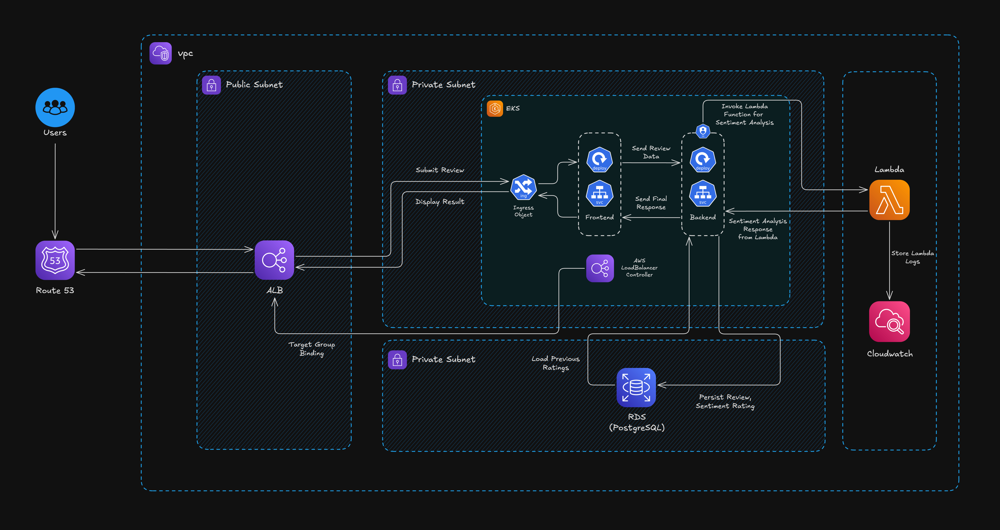

# Movie Analyzer - Lambda Integration

A comprehensive full-stack movie review application with serverless sentiment analysis capabilities, designed for demonstrating modern DevOps practices, cloud-native architecture, **AWS Lambda** integration and **AWS RDS PostgreSQL**.

### Key Features

- **Movie Reviews**: Browse and submit reviews for 6 popular movies
- **Serverless Sentiment Analysis**: Automatic sentiment scoring using AWS Lambda with TextBlob
- **Admin Controls**: Toggle service health, simulate failures, monitor system status
- **Cloud-Native Architecture**: Frontend and backend services with AWS Lambda and RDS
- **AWS RDS PostgreSQL**: Production-ready managed database service
- **Health Monitoring**: Comprehensive health checks and status monitoring

## 🏗️ Architecture

The application consists of two containerized services integrated with AWS Lambda and RDS:



### Services

#### 🎨 Frontend (React + Express)
- **Technology**: React 19.1, Express.js, Node.js 24
- **Features**: 
  - Movie grid with 6 popular movies (Shawshank Redemption, Inception, Interstellar, Fight Club, Gladiator, Dark Knight)
  - Movie detail pages with review submission
  - Admin panel for service health monitoring
  - Real-time health checks and status updates
- **Ports**: 3000 (development), exposed via NodePort 30000 in Kubernetes
- **Health Endpoint**: `/health`

#### ⚙️ Backend (Spring Boot)
- **Technology**: Java 21, Spring Boot 3.5, Maven
- **Features**:
  - RESTful API for review management
  - AWS RDS PostgreSQL integration with JPA/Hibernate
  - AWS Lambda integration for sentiment analysis
  - Admin controls for health simulation
- **Main Endpoints**:
  - `GET /api/reviews/{movieId}` - Get reviews for a movie
  - `POST /api/reviews` - Submit a new review
  - `GET /api/admin/health` - Health check
  - `POST /api/admin/toggle-health` - Toggle service health
  - `GET /api/admin/status` - Admin status dashboard
- **Health Endpoint**: `/actuator/health`

#### 🔗 AWS Lambda Function
- **Technology**: Python 3.12, TextBlob, NLTK
- **Features**:
  - Serverless sentiment analysis
  - Automatic rating generation (1-5 stars) based on sentiment
  - Pay-per-request pricing model
  - Auto-scaling based on demand
  - Confidence scoring (high/medium/low)
- **Function**: `movie-analyzer-sentiment`
- **Actions**: `analyze`, `health`, `status`
- **Sentiment Categories**: Positive (4-5 stars), Neutral (2.5-3.5 stars), Negative (1-2 stars)

#### 🔐 Lambda Authentication

**2 Simple Methods:**
- **`iam`** - Production (IAM roles, IRSA) ⭐⭐⭐⭐⭐
- **`keys`** - Development (Access keys) ⭐⭐⭐

**📋 Complete Setup Guide:** [`LAMBDA_GUIDE.md`](./docs/LAMBDA_GUIDE.md)

#### 🗄️ Database (AWS RDS PostgreSQL)
- **Technology**: AWS RDS PostgreSQL 15.x
- **Schema**: `reviews` table with movie_id, review_text, sentiment, rating, timestamps

## 🚀 Getting Started

### Prerequisites

- **AWS Account**: With RDS access for database setup
- **Docker & Docker Compose**: For local development
- **Kubernetes**: For production deployment (Minikube, K3s, or full cluster)
- **Helm 3.x**: For Helm-based deployment
- **kubectl**: For Kubernetes management
- **PostgreSQL Client**: For database initialization (psql)

### 🗄️ Database Setup (Required First)

**⚠️ Important**: Before deploying the application, you must set up an AWS RDS PostgreSQL instance.

📋 **Follow the detailed guide**: [`RDS_SETUP.md`](./docs/RDS_SETUP.md)

This guide covers:
- Creating AWS RDS PostgreSQL instance
- Configuring security groups and networking
- Running the database initialization script
- Testing connectivity

### Local Development with Docker Compose

After setting up your RDS database and deploying the Lambda function:

```bash
# Clone the repository
git clone <repository-url>
cd movie-analyzer

# Edit Dockercompose file with RDS and Lambda configs

# Database Configuration
# DB_HOST=your-rds-endpoint.region.rds.amazonaws.com
# DB_PORT=5432
# DB_NAME=moviereviews
# DB_USERNAME=movieuser
# DB_PASSWORD=moviepass

# Lambda Configuration
# LAMBDA_FUNCTION_NAME=movie-analyzer-sentiment
# AWS_REGION=ap-south-1
# LAMBDA_AUTH_METHOD=keys

# AWS Credentials (only needed for 'keys' method)
# AWS_ACCESS_KEY_ID=your-access-key
# AWS_SECRET_ACCESS_KEY=your-secret-key


# Start services (sentiment analysis via Lambda)
docker-compose up -d --build

# View logs
docker-compose logs -f

# Stop services
docker-compose down
```

**Access Points:**
- Frontend: http://localhost:3000

### Docker Compose Configuration

The `docker-compose.yml` provides two services integrated with AWS services:

```yaml
services:
  backend:     # Java Spring Boot API (connects to RDS + Lambda)
  frontend:    # React + Express web app
```

**Environment Variables:**
- **Database (RDS)**: `DB_HOST`, `DB_PORT`, `DB_NAME`, `DB_USERNAME`, `DB_PASSWORD`
- **Lambda**: `LAMBDA_FUNCTION_NAME`, `AWS_REGION`, `LAMBDA_AUTH_METHOD`, `AWS_ACCESS_KEY_ID`, `AWS_SECRET_ACCESS_KEY`

## ☸️ Kubernetes Deployment

### Option 1: Raw Kubernetes Manifests

Deploy using organized Kubernetes manifests:

```bash
# Navigate to manifests directory
cd deploy/manifests

# Update RDS endpoint in backend/deployment.yaml
# Replace: your-rds-endpoint.region.rds.amazonaws.com
# With your actual RDS endpoint

# Deploy everything
./deploy.sh deploy

# Check deployment status
./deploy.sh status

# View detailed status
kubectl get all -n movie-analyzer

# Access application
# Frontend available at: http://localhost:30000

# Clean up (RDS database remains unaffected)
./deploy.sh cleanup
```

**Manifest Structure:**
```
deploy/manifests/
├── namespace.yaml              # movie-analyzer namespace
├── backend/
│   ├── deployment.yaml         # 1 replica, 512Mi/500m requests (configured for RDS)
│   │   └── secret.yaml        # RDS database credentials
│   ├── frontend/
│   │   ├── deployment.yaml     # 1 replica, 256Mi/250m requests  
│   │   └── ingress.yaml        # Optional ingress
│   ├── deploy.sh               # Deployment automation
│   ├── kustomization.yaml      # Kustomize configuration
│   └── README.md               # Deployment documentation
```

### Option 2: Kustomize Deployment

Alternative deployment using Kubernetes-native Kustomize:

```bash
# Update RDS endpoint in backend/deployment.yaml first
cd deploy/manifests
kubectl apply -k .

# Delete with kustomize  
kubectl delete -k .
```

**Kustomize Features:**
- Single-command deployment
- Common labels and namespace management
- Environment-specific customizations
- Native kubectl integration

### Option 3: Helm Chart Deployment

Deploy using parameterized Helm charts:

```bash
# Navigate to Helm directory
cd deploy/helm

# Update values.yaml with your RDS endpoint
# Replace: your-rds-endpoint.region.rds.amazonaws.com

# Install with Helm
helm install movie-analyzer .

# Or install with command-line override
helm install movie-analyzer . \
  --set backend.env.DB_HOST="your-actual-rds-endpoint.region.rds.amazonaws.com"

# Upgrade deployment
helm upgrade movie-analyzer .

# Uninstall (RDS database remains unaffected)
helm uninstall movie-analyzer
```

**Helm Structure:**
```
deploy/helm/
├── Chart.yaml                 # Chart metadata
├── values.yaml               # Default configuration values (RDS configured)
├── templates/
│   ├── backend/
│   │   ├── deployment.yaml    # Parameterized backend deployment (RDS)
│   │   ├── service.yaml       # Backend service template
│   │   ├── serviceaccount.yaml # Service account for IRSA
│   │   └── secret.yaml        # RDS credentials template
│   ├── frontend/
│   │   ├── deployment.yaml    # Frontend deployment template
│   │   ├── service.yaml       # Frontend service template
│   │   └── ingress.yaml       # Optional ingress template
│   └── namespace.yaml         # Namespace template
└── README.md                  # Helm-specific documentation
```

## 🔧 Admin Features

### Service Health Monitoring

The application includes comprehensive admin controls for testing resilience:

#### Health Toggle Endpoints
- **Backend Health**: `POST /api/admin/toggle-health`
- **Lambda Health**: `POST /api/admin/toggle-model` (Lambda connection simulation)
- **Database Simulation**: `POST /api/admin/toggle-database`

#### Admin Panel Features
Access via the floating admin panel in the frontend:

1. **Service Status Monitoring**: Real-time health checks every 10 seconds
2. **Health Toggle Controls**: Simulate service failures
3. **System Information**: Memory usage, uptime, processor count
4. **Error Simulation**: Test failure scenarios and recovery

### Testing Scenarios

1. **Backend Failure**: Toggle backend health to test frontend error handling
2. **Database Connectivity**: Simulate RDS connection issues
3. **Lambda Function Failure**: Test sentiment analysis service failures
4. **Overload Simulation**: Test backend overload scenarios

## 📊 API Documentation

### Review Endpoints

#### Get Reviews for Movie
```http
GET /api/reviews/{movieId}
```
**Response**: Array of review objects with sentiment analysis

#### Submit Review
```http
POST /api/reviews
Content-Type: application/json

{
  "movieId": "shawshank",
  "reviewText": "Amazing movie with great story!"
}
```
**Response**: Review object with sentiment analysis and rating

#### Get Review Statistics
```http
GET /api/reviews/stats
```
**Response**: Overall review statistics

#### Get Latest Reviews
```http
GET /api/reviews/latest
```
**Response**: Recent reviews across all movies

### Admin Endpoints

#### Health Check
```http
GET /api/admin/health
```
**Response**: Service health status

#### System Information
```http
GET /api/admin/info
```
**Response**: Memory usage, uptime, system information

#### Toggle Service Health
```http
POST /api/admin/toggle-health
POST /api/admin/toggle-database
POST /api/admin/toggle-model
```
**Response**: Updated service status

## 🛠️ Development

### Building Images

```bash
# Build all images
docker-compose build

# Build individual services
docker build -t movie-backend ./backend
docker build -t movie-frontend ./frontend
```

### Environment Variables

#### Backend (Lambda + RDS Configuration)
- `DB_HOST`: RDS endpoint (required - update with your actual endpoint)
- `DB_PORT`: Database port (default: 5432)
- `DB_NAME`: Database name (default: moviereviews)
- `DB_USERNAME`: Database user (default: movieuser)
- `DB_PASSWORD`: Database password (default: moviepass)
- `LAMBDA_FUNCTION_NAME`: Lambda function name (default: movie-analyzer-sentiment)
- `AWS_REGION`: AWS region (default: ap-south-1)
- `LAMBDA_AUTH_METHOD`: Authentication method (iam or keys)
- `AWS_ACCESS_KEY_ID`: AWS access key (only for keys method)
- `AWS_SECRET_ACCESS_KEY`: AWS secret key (only for keys method)
- `SERVER_PORT`: Backend port (default: 8080)

#### Frontend
- `BACKEND_API_URL`: Backend API URL (default: http://backend:8080)

## 🚦 Monitoring & Health Checks

### Kubernetes Health Checks

#### Readiness Probes
- **Backend**: `/actuator/health` (10s interval)
- **Frontend**: `/health` (5s interval)

#### Liveness Probes
- **Backend**: `/actuator/health` (10s interval)
- **Frontend**: `/health` (10s interval)

## 📁 Project Structure

```
movie-analyzer/
├── backend/                   # Spring Boot backend service (Lambda integration)
│   ├── src/main/java/com/moviereview/
│   │   ├── controller/        # REST controllers
│   │   ├── service/          # Business logic + Lambda service
│   │   ├── repository/       # Data access layer
│   │   ├── entity/           # JPA entities
│   │   └── config/           # Configuration classes
│   ├── Dockerfile
│   └── pom.xml               # Maven dependencies (AWS SDK included)
├── frontend/                  # React frontend service
│   ├── src/
│   │   ├── components/       # React components
│   │   ├── data/            # Static data (movies)
│   │   ├── App.js           # Main React application
│   │   └── index.js         # React entry point
│   ├── public/              # Static assets
│   ├── server.js            # Express server
│   ├── Dockerfile
│   └── package.json         # Node.js dependencies
├── lambda/                    # AWS Lambda function for sentiment analysis
│   ├── lambda_function.py    # Lambda handler
│   ├── requirements.txt      # Python dependencies
│   ├── deploy.sh            # Lambda deployment script
│   └── README.md
├── docs/                      # Organized documentation
│   ├── README.md            # Documentation index
│   ├── LAMBDA_GUIDE.md      # Complete Lambda integration guide
│   └── RDS_SETUP.md         # Database setup guide
├── database/                  # Database initialization
│   └── init.sql             # Database schema and sample data (for RDS setup)
├── deploy/                    # Deployment configurations
│   ├── manifests/           # Kubernetes manifests (Lambda configured)
│   │   ├── backend/
│   │   ├── frontend/
│   │   ├── deploy.sh        # Deployment script
│   │   ├── kustomization.yaml
│   │   └── README.md
│   └── helm/                # Helm chart (Lambda configured)
│       ├── templates/
│       ├── Chart.yaml
│       ├── values.yaml
│       └── README.md
├── docker-compose.yml        # Local development setup (Lambda configured)
├── .gitignore
└── README.md                 # This file
```

## 📚 Documentation

### 📋 Complete Guides
- **[📁 Documentation Hub](./docs/)** - All comprehensive guides
- **[🚀 Lambda Integration](./docs/LAMBDA_GUIDE.md)** - AWS Lambda setup and configuration
- **[🗄️ Database Setup](./docs/RDS_SETUP.md)** - AWS RDS PostgreSQL configuration

### 🚀 Deployment Guides  
- **[☸️ Kubernetes Manifests](./deploy/manifests/README.md)** - Raw Kubernetes deployment
- **[⚒️ Helm Charts](./deploy/helm/README.md)** - Helm-based deployment

---

**Movie Analyzer** - Demonstrating modern cloud-native DevOps practices with serverless Lambda integration and AWS RDS PostgreSQL. 