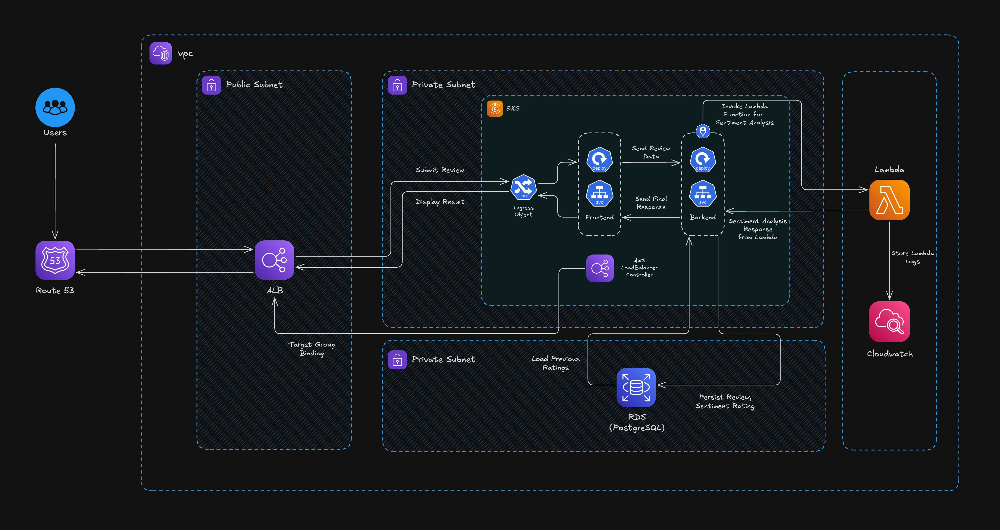

# AWS Lambda Sentiment Analysis Service

This folder contains the AWS Lambda implementation of the movie review sentiment analysis service, replacing the containerized Flask model server with a serverless function.

## 🏗️ Architecture



## 📂 Files

- `lambda_function.py` - Main Lambda handler with sentiment analysis logic
- `requirements.txt` - Python dependencies (TextBlob, NLTK)
- `deploy.sh` - Automated deployment script
- `lambda-deployment-package.zip` - Pre-built deployment package (ready for manual upload)
- `README.md` - This documentation

## 🚀 Deployment Guide

### Prerequisites

### Quick Manual Deployment

**Use the pre-built deployment package:**
The `lambda-deployment-package.zip` file is ready for immediate deployment. You can:

### Option 1: Upload via AWS Console:

   - Go to AWS Lambda console
   - Create new function or update existing
   - Upload `lambda-deployment-package.zip` (2.8MB)


### Option 2: Automated Deployment Script

```bash
# Navigate to lambda directory
cd lambda

# Create Lambda function
./deploy.sh create

# Update existing function
./deploy.sh update

# Test the function
./deploy.sh test

# Get function info
./deploy.sh info

# Delete function
./deploy.sh delete
```

## Manual Testing Guide

After creating the Lambda function via AWS console, you should test:
- ✅ **Health Check** - Function is running correctly
- ✅ **Sentiment Analysis** - Core functionality works
- ✅ **Error Handling** - Invalid inputs are handled
- ✅ **Performance** - Response times are acceptable

## 📋 Method 1: AWS Console Testing (Recommended)

### Step 1: Access Test Interface
1. Go to **AWS Lambda Console**
2. Find your `movie-analyzer-sentiment` function
3. Click on the function name
4. Go to **"Test"** tab
5. Click **"Create new test event"**

### Step 2: Test Event Templates

**Test 1: Health Check**
```json
{
  "action": "health"
}
```
**Expected Response:**
```json
{
  "status": "healthy",
  "service": "lambda-model",
  "timestamp": 1701234567.89,
  "version": "1.0.0",
  "message": "Lambda sentiment analysis service"
}
```

**Test 2: Positive Sentiment**
```json
{
  "action": "analyze",
  "text": "This movie was absolutely fantastic! The acting was superb and the plot was engaging."
}
```
**Expected Response:**
```json
{
  "sentiment": "positive",
  "score": 0.75,
  "confidence": "high",
  "rating": 4.5,
  "timestamp": 1701234567.89,
  "text_length": 86,
  "processed_by": "lambda-textblob"
}
```

## 🖥️ Method 2: AWS CLI Testing

### Prerequisites
```bash
# Ensure AWS CLI is configured
aws sts get-caller-identity

# Should show your account details
```

### CLI Test Commands

**Test 1: Health Check**
```bash
aws lambda invoke \
  --function-name movie-analyzer-sentiment \
  --payload '{"action":"health"}' \
  --region ap-south-1 \
  --cli-binary-format raw-in-base64-out \
  health-response.json

# View response
cat health-response.json
```

**Test 2: Positive Sentiment Analysis**
```bash
aws lambda invoke \
  --function-name movie-analyzer-sentiment \
  --payload '{"action":"analyze","text":"Amazing movie with incredible acting!"}' \
  --region ap-south-1 \
  --cli-binary-format raw-in-base64-out \
  positive-response.json

# View response
cat positive-response.json
```

## 📊 Method 3: Shell Script

```bash
bash quick-test.sh
```

🎉 **Your Lambda function is now tested and ready for production use!** 